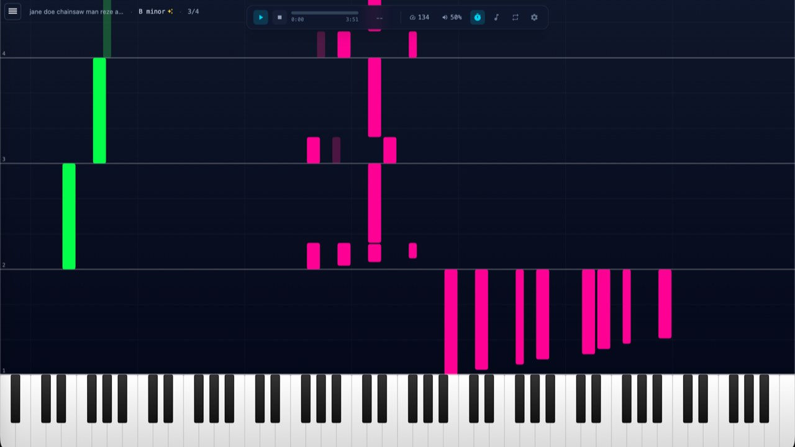

# MIDI Lab

Web MIDI experiments for interactive music tools in the browser.

Live demo: https://midi-lab.vercel.app



## What is included

- **Piano Waterfall** (`/` and `/piano-waterfall`)
  - MIDI file playback with a piano-roll style waterfall visualization
  - Tempo, loop, metronome, transpose, zoom, and keyboard shortcuts
  - Auto-discovery of `.mid/.midi` files from `public/`
- **Gamepad Controller** (`/gamepad-controller`)
  - Maps gamepad axes/triggers to MIDI CC and pitch bend
  - Editable response curves for expression, modulation, and pitch bend
- **Ear Training - Intervals** (`/ear-training-intervals`)
  - Interval drills with preset sets, scoring, and replay controls
  - Optional MIDI keyboard note input via Web MIDI

## Tech stack

- React 19 + TypeScript
- Vite 7
- TanStack Router
- Zustand
- Tailwind CSS 4
- Vitest (unit tests)

## Quick start

### Requirements

- Node.js 20+
- `pnpm` (recommended; lockfile is `pnpm-lock.yaml`)
- A Chromium-based browser for best Web MIDI compatibility (Chrome/Edge)

### Install and run

```bash
git clone https://github.com/pakholeung37/midi-lab.git
cd midi-lab
pnpm install
pnpm dev
```

Open the URL shown by Vite (usually `http://localhost:5173`).

## Available scripts

```bash
pnpm dev        # start dev server
pnpm build      # production build
pnpm preview    # preview production build
pnpm typecheck  # TypeScript check
pnpm lint       # Biome checks
pnpm vitest     # run unit tests
```

## MIDI files and assets

The custom Vite plugin (`vite-plugin-midi-list.ts`) scans the `public/` folder and exposes MIDI files to the app through a virtual module.

To add songs to Piano Waterfall:

1. Put `.mid` or `.midi` files in `public/`.
2. Restart dev server if needed (hot reload is handled for MIDI file changes).

## Project layout

```text
src/
  core/               # shared app stores (e.g., MIDI device state)
  features/
    waterfall/        # waterfall player, rendering, controls
    ear-training/     # interval training logic and UI
  pages/
    piano-waterfall/
    gamepad-controller/
    ear-training-intervals/
  layouts/            # app shell + MIDI output selector
  router.ts           # route definitions
```

## Browser and device notes

- Web MIDI support depends on browser and OS.
- You may need to grant MIDI permissions in browser settings.
- If no MIDI device is connected, the app still works for visualization/training modes that do not require external output.

## Contributing

PRs are welcome. For large changes, open an issue first to align on scope and direction.

## License

MIT. See [LICENSE](./LICENSE).
